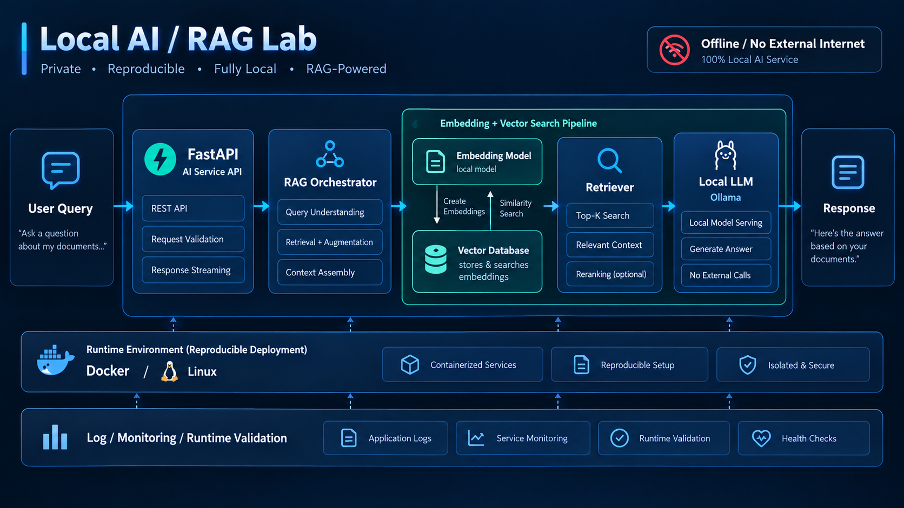

# Local AI / RAG Lab

Local-first Retrieval-Augmented Generation (RAG) technical lab built with Python, Ollama, local embeddings, vector search, FastAPI, Docker and Linux.

> Status: Foundation materialized / implementation in progress.
>
> Planned architecture and validated runtime results are intentionally separated. A capability is not considered complete until evidence is captured under `evidence/`.

## Project Goal

Build a reproducible Local AI / RAG service that can:

- Serve a local LLM with Ollama
- Generate embeddings locally
- Store and search embeddings in a local vector database
- Execute an end-to-end RAG query flow
- Expose the AI service through FastAPI
- Run in a reproducible Docker-based environment
- Validate inference without external Internet dependency
- Capture logs, monitoring signals and runtime validation evidence

## Target Architecture



```text
User Query
    |
    v
FastAPI AI Service
    |
    v
RAG Orchestrator
    |
    +----> Local Embedding Model
    |          |
    |          v
    |      Vector Database
    |          |
    +<---- Top-K Retrieval
    |
    v
Local LLM / Ollama
    |
    v
Response

Runtime:
Linux + Docker

Validation:
Logs + Monitoring + Runtime Checks

Target Constraint:
No external Internet dependency during inference
```

## Technology

- Python
- Ollama
- RAG
- Embedding
- Vector Database
- FastAPI
- Docker
- Linux
- Git / GitHub

The embedding model and vector database are intentionally not pinned yet. They will be selected and recorded as implementation decisions during the lab.

## Repository Structure

```text
local-ai-rag-lab/
├── README.md
├── docs/
│   └── architecture.png
├── app/
│   ├── api/
│   ├── rag/
│   ├── embedding/
│   └── retrieval/
├── data/
│   └── sample/
├── tests/
├── evidence/
├── docker/
├── .gitignore
├── requirements.txt
└── docker-compose.yml
```

## Validation Contract

Current state:

```text
LOCAL_LLM_SERVING=PENDING
EMBEDDING_PIPELINE=PENDING
VECTOR_SEARCH=PENDING
RAG_QUERY_FLOW=PENDING
FASTAPI_SERVICE=PENDING
DOCKER_REPRODUCIBILITY=PENDING
OFFLINE_EXTERNAL_NETWORK=PENDING
LOCAL_AI_RESPONSE=PENDING
RUNTIME_MONITORING=PENDING
```

A status changes from `PENDING` to `PASS` only after runtime evidence has been captured and retained.

## Intended Acceptance Criteria

- [ ] Ollama serves a selected local model
- [ ] Embeddings are generated without an external inference API
- [ ] Documents can be indexed in the local vector store
- [ ] Top-K retrieval returns relevant local context
- [ ] RAG response is generated from retrieved context
- [ ] FastAPI exposes health and query endpoints
- [ ] Docker deployment can be reproduced
- [ ] External network access can be disabled during validation
- [ ] Local inference still succeeds after external access is disabled
- [ ] Logs, health status and validation receipts are retained

## Evidence

Runtime receipts and validation artifacts will be stored under:

`evidence/`

Evidence records what was actually observed.

Architecture and documentation describe intended behavior and must not be treated as runtime proof.

## Security / Data Handling

This public lab must not contain:

- API keys or credentials
- SSH private keys
- production secrets
- proprietary employer information
- private internal network information
- sensitive customer or personal documents

Only synthetic or explicitly public documents will be used for RAG tests.

## Portfolio Context

This project demonstrates the integration of:

**AI Application Engineering**  
+  
**Linux / Container Platform**  
+  
**Production Operations**  
+  
**Observability**  
+  
**Runtime Validation**

The goal is not only to make an LLM answer questions, but to demonstrate that a Local AI service can be deployed, observed, reproduced and validated.

## Current Phase

**Phase 0 — Repository / README / Architecture Materialization**

Next:

**Phase 1 — Local Runtime Baseline + Ollama + FastAPI Health Path**
